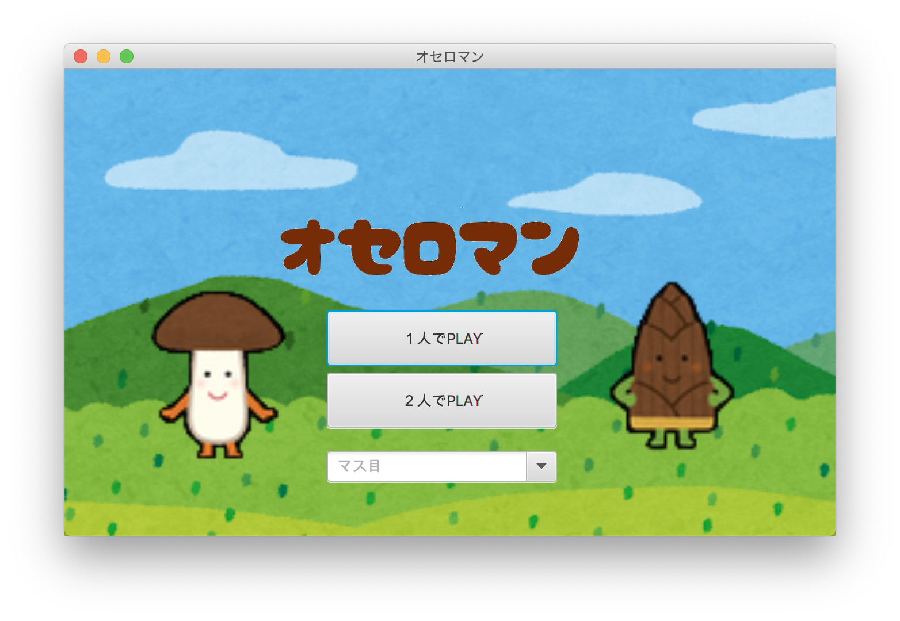
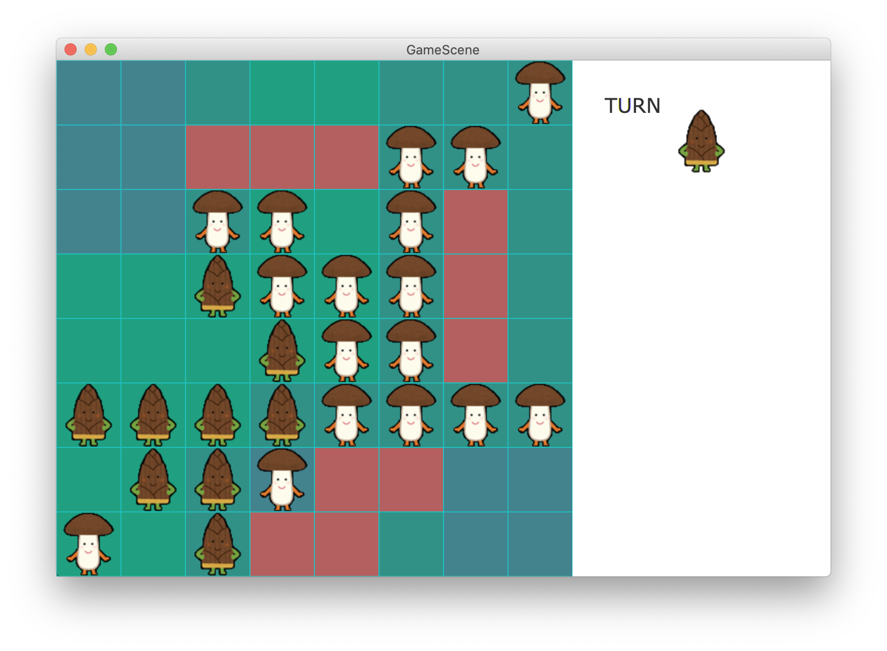

# NokoGame
This is a game like war.
It is based on Othello and Minesweeper.
There are bamboo shoots and mushrooms which fight on the board.
Be careful!!
There are some bombs, and they will explode if they are stepped on.
So, this is exciting game.
Get the win.

SlideShare(Detail): [https://www.slideshare.net/TenTokoro/noko-game](https://www.slideshare.net/TenTokoro/noko-game)




## Getting Started
### Prerequisites
This project requires Java 8.
```
$java -version
java version "1.8.0_192"
Java(TM) SE Runtime Environment (build 1.8.0_192-b12)
Java HotSpot(TM) 64-Bit Server VM (build 25.192-b12, mixed mode)
```
### Installing
Please compile all java files.
```
javac *.java
```

### Usage
Entry point is GameStart class.
```
java GameStart
```
